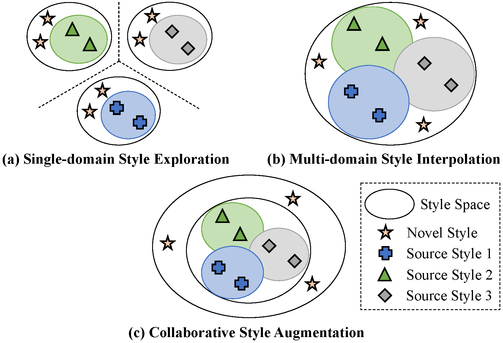
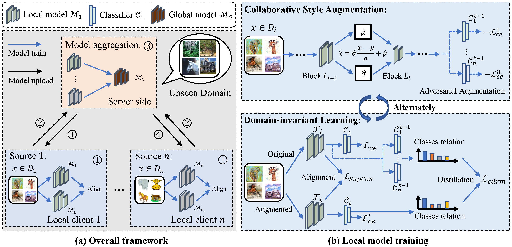
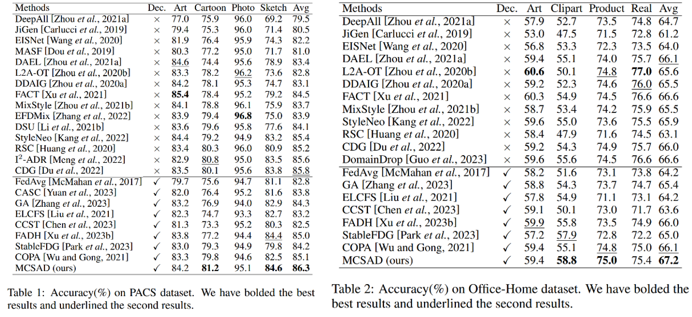
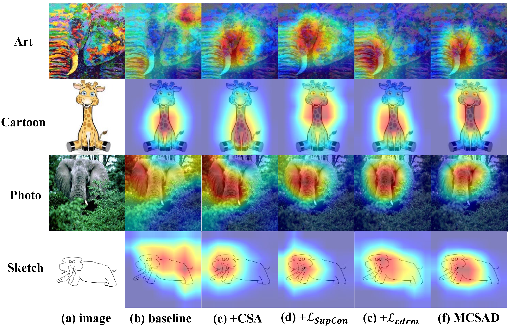

# Multi-Source Collaborative Style Augmentation and Domain-Invariant Learning for Federated Domain Generalization
Here is the official implementation of `MCSAD` method in the paper `Multi-Source Collaborative Style Augmentation and Domain-Invariant Learning for Federated Domain Generalization, in IJCAI 2025` [paper](https://www.arxiv.org/abs/2505.10152).

## Abstract
Federated domain generalization aims to learn a generalizable model from multiple decentralized source domains for deploying on the unseen target domain. The style augmentation methods have achieved great progress on domain generalization. However, the existing style augmentation methods either explore the data styles within isolated source domain or interpolate the style information across existing source domains under the data decentralization scenario, which leads to limited style space. To address this issue, we propose a Multi-source Collaborative Style Augmentation and Domain-invariant learning method (MCSAD) for federated domain generalization. Specifically, we propose a multi-source collaborative style augmentation module to generate data in the broader style space. Furthermore, we conduct domaininvariant learning between the original data and augmented data by cross-domain feature alignment within the same class and classes relation ensemble distillation between different classes to learn a domain-invariant model. By alternatively conducting collaborative style augmentation and domaininvariant learning, the model can generalize well on unseen target domain. Extensive experiments on multiple domain generalization datasets indicate that our method significantly outperforms the stateof-the-art federated domain generalization methods.

## Different style augmentation paradigm under data decentralization scenario

  

* (a) Single-domain style exploration on the isolated source domains ignores the styles of other domains, which leads to limited style diversity.
* (b) Multi-domain style interpolation mixes the shared style information across decentralized source domains, which leads to the generated styles within the existing source domains.
* (c) Collaborative style augmentation proposed in this work generates data with novel styles out of the existing source domains, which can explore the broader style space.

## Method

  

* (a) The overall framework of our method. 
* (b) The local training on decentralized source domains, where collaborative style augmentation and domain-invariant learning are conducted alternatively.

## Setup
### Install Package Dependencies
```
Python Environment: >= 3.6
torch >= 1.2.0
torchvision >= 0.4.0
tensorbard >= 2.0.0
numpy
yaml
```
### Install Datasets
Please prepare the PACS, Office-Home, VLCS dataset for FedDG task and Digits-5, Office-Caltech10 dataset for FedDA task.
```
base_path
│       
└───dataset
│   │   pacs
│       │   images
│       │   splits
│   │   office_home_dg
│       │   art
│       │   clipart
│       │   product
│       │   real_world
│   │   DigitFive
│       │   ...
│   │   OfficeCaltech10
│       │   ...
```


### FedDG
The configuration files can be found under the folder  `./config`, and we provide four config files with the format `.yaml`. To perform the FedDG on the specific dataset (e.g., PACS), please use the following commands:

```python
nohup python main_dg.py --config PACS.yaml --target-domain art_painting -bp ../ --lr_adv 2.0 --con 0.0 --cdrm 0.0 --seed 2 --wandb 0 --gpu 3 > ./log/pacs_res18_adv_lr2_SupCon0_cdrm0_art_painting_seed2_avgcls.txt 2>&1 &

nohup python main_dg.py --config PACS.yaml --target-domain cartoon -bp ../ --lr_adv 2.0 --con 0.0 --cdrm 0.0 --seed 2 --wandb 0 --gpu 4 > ./log/pacs_res18_adv_lr2_SupCon0_cdrm0_cartoon_seed2_avgcls.txt 2>&1 &

nohup python main_dg.py --config PACS.yaml --target-domain photo -bp ../ --lr_adv 2.0 --con 0.0 --cdrm 0.0 --seed 2 --wandb 0 --gpu 5 > ./log/pacs_res18_adv_lr2_SupCon0_cdrm0_photo_seed2_avgcls.txt 2>&1 &

nohup python main_dg.py --config PACS.yaml --target-domain sketch -bp ../ --lr_adv 2.0 --con 0.0 --cdrm 0.0 --seed 2 --wandb 0 --gpu 6 > ./log/pacs_res18_adv_lr2_SupCon0_cdrm0_sketch_seed2_avgcls.txt 2>&1 &
```


The results on PACS and Office-Home dataset for FedDG task are follows.

  

The Grad-CAM visualization on PACS dataset is follows.

  

## Reference

If you find this useful in your work please consider citing:
```
@article{wei2025multi,
  title={Multi-Source Collaborative Style Augmentation and Domain-Invariant Learning for Federated Domain Generalization},
  author={Wei, Yikang},
  journal={arXiv preprint arXiv:2505.10152},
  year={2025}
}
```

And there are some federated multi-source domain adaptation methods proposed by us.
```
@article{Wei_Han_2024, 
  title={Multi-Source Collaborative Gradient Discrepancy Minimization for Federated Domain Generalization},
  journal={Proceedings of the AAAI Conference on Artificial Intelligence}, 
  author={Wei, Yikang and Han, Yahong}, 
  volume={38}, 
  number={14}, 
  year={2024}, 
  month={Mar.}, 
  pages={15805-15813},
  DOI={10.1609/aaai.v38i14.29510} 
}

@article{wei2023multi,
  title={Multi-Source Collaborative Contrastive Learning for Decentralized Domain Adaptation}, 
  author={Wei, Yikang and Yang, Liu and Han, Yahong and Hu, Qinghua},
  journal={IEEE Transactions on Circuits and Systems for Video Technology}, 
  volume={33},
  number={5},
  pages={2202-2216},
  year={2023},
  doi={10.1109/TCSVT.2022.3219893}
}

@inproceedings{wei2023exploring,
  title={Exploring Instance Relation for Decentralized Multi-Source Domain Adaptation},
  author={Wei, Yikang and Han, Yahong},
  booktitle={ICASSP 2023-2023 IEEE International Conference on Acoustics, Speech and Signal Processing (ICASSP)},
  pages={1--5},
  year={2023},
  organization={IEEE}
}

@article{wei2022dual,
  title={Dual collaboration for decentralized multi-source domain adaptation},
  author={Wei, Yikang and Han, Yahong},
  journal={Frontiers of Information Technology \& Electronic Engineering},
  volume={23},
  number={12},
  pages={1780--1794},
  year={2022},
  publisher={Springer}
}
```

## Acknowledgments
Please refer to train.py for additional details.
